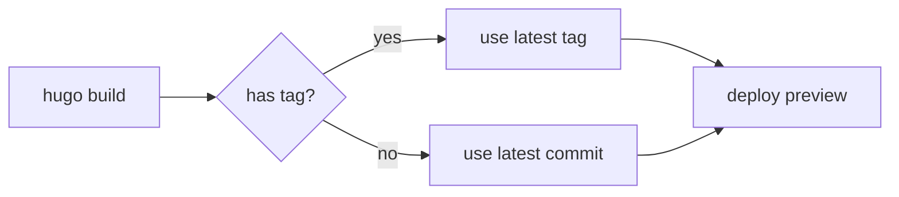

This page demonstrates every content shortcode that ships with Inkstone. Each section shows the source markdown and the rendered result. Use it as both a smoke test and a copy-paste reference.

For shortcodes that depend on external CDN libraries (mermaid, markmap, antv-g2, etc.), the loaders only inject when the page actually uses them — pages without the shortcode pay zero JS cost.

---

## Callouts & Admonitions

### `callout` — short colored note

Five severity levels with i18n-aware default titles.

```markdown

This is a note callout. Use it for tangential context.

```


This is a note callout. Use it for tangential context.



Tip callout (no explicit title — uses i18n default).



Always run `git stash` before destructive operations.


### `admonition` — foldable longer block

Same severities as `callout` but with optional fold/unfold and an icon.

```markdown

Long-form callout content goes here. Useful when the
note itself contains multiple paragraphs or code blocks.

```


Long-form callout content goes here. Useful when the note itself contains multiple paragraphs or code blocks. The `foldable=true` lets readers collapse it after reading.



Inkstone 0.x → 1.x will be a breaking change for the design token API. Pin to `~0` until you've reviewed the migration guide.


---

## Layout & Composition

### `flex` + `flex-item` — flexbox layout helper

Wrap children in a flex container with control over direction, gap, and alignment.

```markdown

  **Left** column content.
  **Right** column content.

```


  **Left** column content. Useful for side-by-side comparisons or "before/after" prose.
  **Right** column content. The wrapper accepts standard flex properties.


### `tab` + `tab-item` — tabbed content

```markdown

  
```python
print("hello")
```
  
  
```javascript
console.log("hello");
```
  

```

### `details` — collapsible disclosure

```markdown

Hidden content goes here.

```


Hidden content goes here. Use it for long appendices, derivations, or "if you really want to know" sidebars.


---

## Code & Text

### `highlight` — syntax-highlighted block with title

A wrapper around Chroma that adds an optional title bar.

```markdown

def fib(n):
    return n if n < 2 else fib(n-1) + fib(n-2)

```

### `include` — inline another file (raw HTML)

```markdown

```



### `include-code` — inline another file as a code block

```markdown

```



### `copy-to-clipboard` — inline copy button

```markdown

```

Email: 

### `pseudocode` — academic pseudocode rendering

Renders LaTeX-style algorithm pseudocode. Lazy-loads the renderer only on pages that use it.

```markdown

\begin{algorithm}
\caption{Binary Search}
\begin{algorithmic}
\REQUIRE sorted array $A$, target $t$
\STATE $\ell \gets 0$, $r \gets |A| - 1$
\WHILE{$\ell \leq r$}
  \STATE $m \gets \lfloor (\ell + r) / 2 \rfloor$
  \IF{$A[m] = t$} \RETURN $m$ \ENDIF
  \IF{$A[m] < t$} \STATE $\ell \gets m + 1$
  \ELSE \STATE $r \gets m - 1$
  \ENDIF
\ENDWHILE
\RETURN $-1$
\end{algorithmic}
\end{algorithm}

```

### `button` — styled link as button

```markdown
View on GitHub
```

View on GitHub

### `pullquote` — large emphasized quote

```markdown

A classic is a book that has never finished saying what it has to say.

```


A classic is a book that has never finished saying what it has to say.


---

## Media

### `figure` — captioned image

```markdown

```



### `image-compare` — before/after slider

```markdown

```



### `gallery` — justified grid + lightbox

Driven by a JSON data file. The fixture below lives at `static/data/smoke/gallery.json`.

```markdown

```



### `video` — self-hosted MP4/WebM

```markdown

```

> Skipped here because `exampleSite/` ships with no MP4 fixture. See the source code at `layouts/shortcodes/video.html` for the full parameter list.

### `youtube` — YouTube embed

```markdown

```



### `bilibili` — Bilibili embed

```markdown

```

> Live render skipped to avoid loading external iframes during the demo build. The shortcode accepts `bvid` (preferred) or `aid`.

### `song` — NetEase Music single-track player

```markdown

```

> Live render skipped (CDN dependency). The shortcode accepts NetEase track IDs via `id`.

### `swiper` — JSON-driven carousel

```markdown

```

> No fixture shipped in `exampleSite/`. See `layouts/shortcodes/swiper.html` for the schema.

---

## Diagrams & Math

### Mermaid diagrams (via fenced codeblock)

````markdown

````


### Markmap mind maps (via fenced codeblock)

````markdown
```markmap
# Inkstone
## Layouts
- baseof
- single
- list
## Shortcodes
- callout
- admonition
- gallery
```
````

```markmap
# Inkstone
## Layouts
- baseof
- single
- list
## Shortcodes
- callout
- admonition
- gallery
```

### `antv-g2` — declarative chart

```markdown

```

> No script fixture shipped. The shortcode loads `@antv/g2` from CDN and runs your chart spec from the given resource path. See `static/data/smoke/` patterns to provide your own.

### Math (MathJax v4)

Inline: $E = mc^2$.

Block:

$$
\frac{\partial}{\partial t} \rho + \nabla \cdot (\rho \mathbf{v}) = 0
$$

The MathJax CDN is only injected on pages that contain math delimiters — pages without math pay zero cost.

---

## External & Embeds

### `iframe` — embed external content with theme bridge

The theme passes a `theme=light|dark` query param to known hosts (codepen.io, codesandbox.io, stackblitz.com, replit.com), so embedded content matches the site's current theme.

```markdown

```

> Live render skipped to keep this demo offline-friendly. The bridge whitelist lives at `data/iframe_theme_hosts.toml`.

### `douban-card` — Douban book/movie card

```markdown

```

> Requires Douban API access. The shortcode renders a card linking back to Douban.

### `wechat-qr` — WeChat OA QR popover

```markdown

```

Hover or focus this element to see a QR code popover: 

---

## Summary

That's the full shortcode catalog as of the current release. For production usage:

- **Always pass `alt`** on `figure`, `image-compare`, and `gallery` for a11y
- **Don't autoplay video** unless you're embedding a silent looping clip — Inkstone defaults `autoplay=false`
- **Lazy-loaded shortcodes** (mermaid, markmap, antv-g2, mathjax, pseudocode, swiper, song) only fetch their CDN libs when the shortcode is actually present on the page

Issues or feature requests: [github.com/BerBai/inkstone/issues](https://github.com/BerBai/inkstone/issues).
