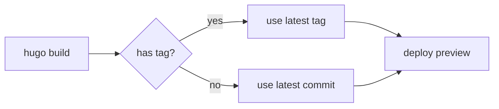

本页演示 Inkstone 自带的全部内容 shortcode。每一节都给出源码 markdown 与渲染结果，可以作为冒烟测试，也可以直接拷走当模板使用。

依赖外部 CDN 的 shortcode（mermaid、markmap、antv-g2 等），加载器只在该页真正用到时才注入——没用到的页面零 JS 成本。

---

## Callout 与 Admonition

### `callout` —— 简短的着色提示

五个严重程度，标题会按 i18n 自动取默认值。

```markdown

这是一个 note 类型 callout，用来放偏题但相关的上下文。

```


这是一个 note 类型 callout，用来放偏题但相关的上下文。



Tip callout（没显式给标题——用 i18n 默认值）。



做破坏性操作之前，先 `git stash` 一下。


### `admonition` —— 可折叠的较长块

严重程度与 `callout` 相同，但可选折叠/展开，并自带图标。

```markdown

长文本 callout 内容放在这里。当提示本身包含
多个段落或代码块时很有用。

```


长文本 callout 内容放在这里。当提示本身包含多个段落或代码块时很有用。`foldable=true` 让读者读完之后可以收起。



Inkstone 0.x → 1.x 会对设计 token API 做破坏性变更。在你看完迁移指南之前，请把版本锁在 `~0`。


---

## 布局与组合

### `flex` + `flex-item` —— flexbox 布局辅助

把子元素包进 flex 容器，可以控制方向、间距、对齐。

```markdown

  **左**列内容。
  **右**列内容。

```


  **左**列内容。适合用来做并排对比或"前/后"散文。
  **右**列内容。这个 wrapper 接受标准的 flex 属性。


### `tab` + `tab-item` —— 切换页内容

`tab-item` 必须使用 `{}` 这种 markdown 形态——否则内部的 ```` ``` ```` 围栏代码块不会被解析。`label=` 是 Tab 头文字。

````markdown

  {}
```python
print("hello")
```
  {}
  {}
```javascript
console.log("hello");
```
  {}

````


  {}
```python
print("hello")
```
  {}
  {}
```javascript
console.log("hello");
```
  {}


### `details` —— 可折叠披露

```markdown

被折叠的内容写在这里。

```


被折叠的内容写在这里。适合用来放长附录、推导过程，或"如果你真想知道"的旁白。


---

## 代码与文本

### `highlight` —— 带标题的语法高亮块

对 Chroma 的封装，加了一条可选的标题栏。

```markdown

def fib(n):
    return n if n < 2 else fib(n-1) + fib(n-2)

```


def fib(n):
    return n if n < 2 else fib(n-1) + fib(n-2)


### `include` —— 把另一个文件作为原始 HTML 内联

```markdown

```



### `include-code` —— 把另一个文件作为代码块内联

```markdown

```



### `copy-to-clipboard` —— 行内复制按钮

`text=` 是按钮上显示的文字，被复制到剪贴板的是 Inner 内容。

```markdown
邮箱：user@example.com
```

邮箱：user@example.com

### `pseudocode` —— 学术伪代码渲染

渲染 LaTeX 风格的算法伪代码。渲染器只在用到的页面才懒加载。

```markdown

\begin{algorithm}
\caption{Binary Search}
\begin{algorithmic}
\REQUIRE sorted array $A$, target $t$
\STATE $\ell \gets 0$, $r \gets |A| - 1$
\WHILE{$\ell \leq r$}
  \STATE $m \gets \lfloor (\ell + r) / 2 \rfloor$
  \IF{$A[m] = t$} \RETURN $m$ \ENDIF
  \IF{$A[m] < t$} \STATE $\ell \gets m + 1$
  \ELSE \STATE $r \gets m - 1$
  \ENDIF
\ENDWHILE
\RETURN $-1$
\end{algorithmic}
\end{algorithm}

```


\begin{algorithm}
\caption{Binary Search}
\begin{algorithmic}
\REQUIRE sorted array $A$, target $t$
\STATE $\ell \gets 0$, $r \gets |A| - 1$
\WHILE{$\ell \leq r$}
  \STATE $m \gets \lfloor (\ell + r) / 2 \rfloor$
  \IF{$A[m] = t$} \RETURN $m$ \ENDIF
  \IF{$A[m] < t$} \STATE $\ell \gets m + 1$
  \ELSE \STATE $r \gets m - 1$
  \ENDIF
\ENDWHILE
\RETURN $-1$
\end{algorithmic}
\end{algorithm}


### `button` —— 把链接渲染为按钮样式

```markdown
在 GitHub 上查看
```

在 GitHub 上查看

### `pullquote` —— 大字强调引言

```markdown

经典是这样一种作品——它永远没有把要说的话说完。

```


经典是这样一种作品——它永远没有把要说的话说完。


### `rating` —— 通用星级评分

仅展示星级，最大刻度可配（默认 5），输入会四舍五入到最近 0.5，并 clamp 到 `[0, max]`。`aria-label` 走 i18n，使用四舍五入后的值，保证视觉与读屏一致。

```markdown
我的评价：（满分 5）

10 分制：
```

我的评价：（满分 5）

10 分制：

---

## 媒体

### `figure` —— 带说明的图片

```markdown

```



### `image-compare` —— 前后对比滑块

shortcode 接收 `image-before` 和 `image-after`（注意带前缀，是底层组件要求的属性名）。

```markdown

```



### `gallery` —— 等高网格 + 灯箱

由 JSON 数据文件驱动。下面这份 fixture 在 `static/data/smoke/gallery.json`（用绝对路径，JSON 才能从任意页面 URL 拉到）。

```markdown

```



### `video` —— 自托管的 MP4/WebM

```markdown

```

> 这里跳过实际渲染，因为 `exampleSite/` 没有打包 MP4 fixture。完整参数列表见源码 `layouts/shortcodes/video.html`。

### `youtube` —— YouTube 嵌入

```markdown

```



### `bilibili` —— B 站嵌入

```markdown

```

> 跳过实际渲染，避免在 demo 构建过程中加载外部 iframe。shortcode 接受 `bvid`（推荐）或 `aid`。

### `song` —— 网易云音乐单曲播放器

```markdown

```

> 跳过实际渲染（依赖 CDN）。shortcode 通过 `id` 接收网易云音乐的曲目 ID。

### `swiper` —— JSON 驱动的轮播

```markdown

```

> `exampleSite/` 没附带 fixture。schema 见 `layouts/shortcodes/swiper.html`。

---

## 图表与数学

### Mermaid 图表（通过 fenced codeblock）

````markdown

````


### Markmap 思维导图（通过 fenced codeblock）

````markdown
```markmap
# Inkstone
## Layouts
- baseof
- single
- list
## Shortcodes
- callout
- admonition
- gallery
```
````

```markmap
# Inkstone
## Layouts
- baseof
- single
- list
## Shortcodes
- callout
- admonition
- gallery
```

### `antv-g2` —— 声明式图表

```markdown

```

> 没附带脚本 fixture。这个 shortcode 通过 CDN 加载 `@antv/g2`，并跑你给的 resource 路径下的图表 spec。可以参考 `static/data/smoke/` 的结构来准备自己的数据。

### 数学公式（MathJax v4）

行内：$E = mc^2$。

块级：

$$
\frac{\partial}{\partial t} \rho + \nabla \cdot (\rho \mathbf{v}) = 0
$$

MathJax CDN 只在带数学分隔符的页面注入——没数学公式的页面零成本。

---

## 外部嵌入

### `iframe` —— 嵌入外部内容（带主题桥接）

主题会向已知 host（codepen.io、codesandbox.io、stackblitz.com、replit.com）传递 `theme=light|dark` 查询参数，让嵌入内容跟当前站点主题匹配。

```markdown

```

> 跳过实际渲染，让本 demo 保持离线友好。桥接白名单在 `data/iframe_theme_hosts.toml`。

### `douban-card` —— 豆瓣书影音卡片

```markdown

```

> 需要访问豆瓣 API。shortcode 渲染一张回链豆瓣的卡片。

### `wechat-qr` —— 微信公众号二维码气泡

```markdown

```

悬停或聚焦下面这个元素，即可看到二维码气泡：

---

## 小结

以上就是当前发行版下完整的 shortcode 目录。生产场景使用建议：

- **永远给 `figure`、`image-compare`、`gallery` 加 `alt`**，照顾无障碍
- **不要让视频自动播放**，除非你嵌的是无声的循环片段——Inkstone 默认 `autoplay=false`
- **懒加载的 shortcode**（mermaid、markmap、antv-g2、mathjax、pseudocode、swiper、song）只在页面真正用到时才会请求 CDN 库

提 issue 或功能请求：[github.com/BerBai/inkstone/issues](https://github.com/BerBai/inkstone/issues)。
